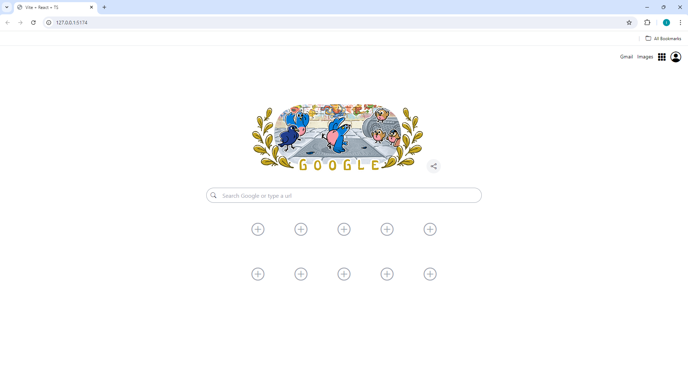

# Google-Clone

## Project Overview
Google-Clone is a web application that mimics the basic functionality and design of the Google search homepage. It is built using modern web technologies including React, TypeScript, and Tailwind CSS.

## Desktop View

## Mobile View

Built by [Raffa.Dev]